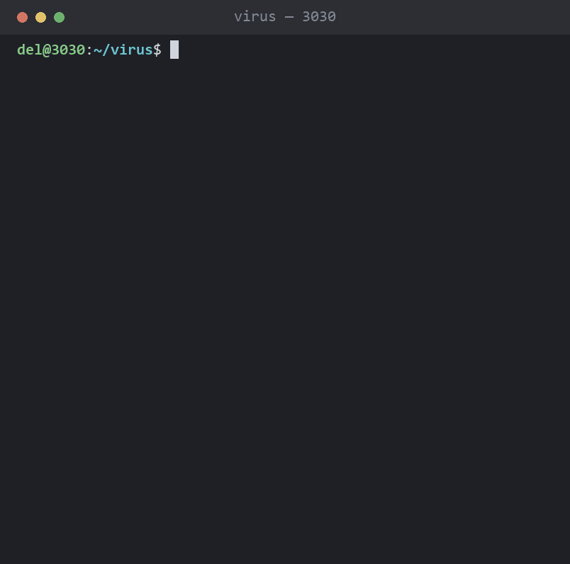

# 3030

> _"I want to devise a virus / to bring dire straits to your environment /
> crash your whole computer system / and revert you to papyrus"_
> — Deltron 3030, _Virus_ (2000)

Deltron 3030 is a concept album from 2000 about a mech soldier rap battling
through a corporate dystopia in the year 3030. Half its tracklist describes
technology failing people in ways that turn out to be very easy to render in
a terminal.

So: the album, as command-line programs. One file per track.



```bash
python deltron.py            # the tracklist
python deltron.py virus      # play a track
python deltron.py --check    # every self-check in the repo
```

Stdlib only. Python 3.8+. No pip install, no venv, nothing to uninstall.

## The tracklist

### 5. Virus — `virus.py`

Somebody had to try. Four acts: a fake boot, the impossible requirements
failing deadpan, a Win95 folder bomb **rendered rather than executed**, and a
terminal that slowly fills with papyrus until it is a scroll.

It does **nothing** to your computer. That is the joke — the honest
implementation of the entire verse is one `print()`, and this is four hundred
lines instead.

```bash
python virus.py            # ~45s, bassline on
python virus.py --fast     # two seconds
```

### 12. Upgrade (A Brand New Day) — `upgrade.py`

An upgrade process that is flawless, thorough, patient, beautifully
instrumented, and changes nothing. A changelog of filler. An ETA that gets
worse before it gets better. Config migrated into itself. A restart into the
identical screen. The version goes up, the feature count goes down, and the
last line is `0 files changed`, which is a true statement about the program
rather than a bit.

```bash
python upgrade.py --rollback   # the truest line in the program
```

`virus.py` is a threat that cannot be carried out. `upgrade.py` is a promise
kept to the letter that means nothing. Same joke from the other end.

### 10. Time Keeps On Slipping — `slipping.py`

A clock that is correct when it starts and is not correct for long. The drift
is exponential, so the first half minute looks fine, a minute in you are a
couple of minutes fast, three minutes in you are weeks ahead, and around
minute five it arrives in 3030 and stops.

```bash
python slipping.py             # ~5 min to 3030
python slipping.py --drift 4   # slip sooner (time constant, seconds)
```

`--drift` is the calibration knob. The default is tuned so the slip stays
invisible exactly long enough to be annoying.

### 2. 3030 — `y3k.py`

The only thing here that does something real. A Y3K compliance checker: it
scans for date handling that will not survive the year 3030 and reports the
year each finding actually breaks in.

```bash
python y3k.py             # scan the current directory
python y3k.py path/to/src
```

2038 for 32-bit clocks and 2100 for two-digit years are genuine bugs with
genuine dates attached. The Y10K rule is not, and is marked LOW accordingly.
Exits 1 on findings, so it works in CI, which is an absurd thing for this
repo to be able to say. `y3k: ignore` on a line skips it;
`y3k: ignore-start` / `-end` skips a block.

### 6. Mastermind — `mastermind.py`

A lock on the corporate tower and ten tries at it. Six glyphs, four slots,
repeats allowed; after each attempt the panel says how many glyphs are in the
right slot and how many are right but somewhere else.

```bash
python mastermind.py            # play
python mastermind.py --seed 7   # the same lock every time
```

The one program here that is a real game, with logic you can lose to. The
rest of the album is theater; this one keeps score. A malformed guess is a
typo, not an attempt, and does not cost you one.

## The safety rails, since one of these is called `virus`

- No writes outside this repo. **None.** Nothing is created, so there is
  nothing to clean up.
- No self-replication, ever. The folder bomb is `print()` in a loop.
- No network, no subprocess against the system, no registry, no startup
  entry, no persistence.
- `upgrade.py` never touches a real package manager. A fake upgrade that
  shells out to a real one is not a joke.
- `finally:` restores your cursor and colors on Ctrl-C. Always.
- `python deltron.py --check` asserts all of it, per track.

The self-checks assert the jokes, not just the code: that the ETA gets worse
before it gets better, that `This will only take a moment` is the longest
step, that the clock is correct at zero seconds, that the post-upgrade banner
comes back **unchanged**.

## The spec review

Before writing any of it we triaged the requirements. The client is Del. The
spec is a rap verse.

| Requirement | Verdict |
|---|---|
| "bring dire straits to your environment" | a mood, not a spec |
| "revert you to papyrus" | closest real behavior is *paperweight*. off by one material |
| "no Microsoft or Windows when I'm through" | you cannot uninstall a corporation |
| "a file gets deleted / Bingo! hard drive" | this is `del`. shipped 1981. **Del invented Del** |
| "shut down the entire whitehouse" | air-gapped |
| "corrupt politicians" | no-op, idempotent |
| "even space stations" | 400ms RTT, custom RTOS, they'd notice |
| "3030" | a thousand years of forward compat. a millennium LTS |

Exactly one line in the verse describes a real mechanism: **replication**.
The Win95 folder bomb — not clever, just `mkdir` in a loop until Explorer
gave up. So that is the one we perform, and we perform it as theater.

## The music

`winsound.Beep` on a daemon thread. A four-note riff at 90bpm that sounds
like a 1997 shareware installer, which is the correct sound for this. Windows
only; elsewhere the import fails, audio goes quiet, everything else runs.

`music.py` writes the riff out as **`virus.mid`** (bass + drums, 13 seconds,
1 KB) with hand-rolled `struct.pack` and no MIDI library. The notes are
original — see the Notice.

## How it is put together

```
deltron.py     the umbrella. runpy, not a plugin system
theater.py     the shared stage: typewriter, sleeps, terminal restore
virus.py       track 5
mastermind.py  track 6
upgrade.py     track 12
slipping.py    track 10
y3k.py         track 2
music.py       writes virus.mid
lyrics.txt     act 4 of virus scrolls whatever is in here
changelog.txt  the filler upgrade.py reads
docs/demo.py   makes the GIF above, with termshot
```

`theater.py` was extracted at the **fourth** track, not the first — three
programs had grown their own copy by then, which is when you know what the
shared thing actually is. The third track (`y3k.py`) turned out not to want
it at all, being a linter rather than an animation.

The GIF is not a screen recording — it is
[termshot](https://github.com/sp00nznet/termshot), which fakes terminal
captures with Pillow. Faking a demo of a fake virus felt correct.

## Binaries

PyInstaller cannot cross-compile, so
[`.github/workflows/build.yml`](.github/workflows/build.yml) builds on one
runner per platform and uploads `deltron` / `deltron.exe` on any `v*` tag.
The macOS build is arm64 and unsigned — right-click → Open the first time, or
`xattr -d com.apple.quarantine deltron`.

You do not need any of that. Every track is stdlib-only Python with a
shebang, so `./deltron.py virus` already works everywhere.

## Notice

An unofficial, non-commercial fan project. Not affiliated with, endorsed by,
or connected to Deltron 3030, Del the Funky Homosapien, Dan the Automator,
Kid Koala, or their labels. Made as homage, by someone who thinks a 2000
concept album about a mech soldier rap battling through a corporate dystopia
is one of the best records ever built.

- **The lyrics** are a four-line excerpt, quoted with attribution, in a
  project that exists to comment on those four lines. Rights remain with
  their owners. Don't paste the full verse into the repo.
- **The music is original.** The riff is four notes written to sound like a
  1997 shareware installer. It is not a transcription of, sample of, or
  derivative of the album's instrumental.
- **The code** is free to take. The song isn't ours to give.

## License

MIT for everything in this repo — code, `virus.mid`, docs. See
[LICENSE](LICENSE), which carves out the quoted lyrics: those aren't ours to
license to you.

## Credit

Deltron 3030 — Del the Funky Homosapien, Dan the Automator, Kid Koala.
Go buy the album. It's better than this.

**[deltron3030.com](https://deltron3030.com/)** — the official site. Tour
dates, music, merch. They are playing shows again, which is a better use of
an evening than any of this.

Still not affiliated with them in any way. Just pointing at the people who
made the thing worth making a joke about.
