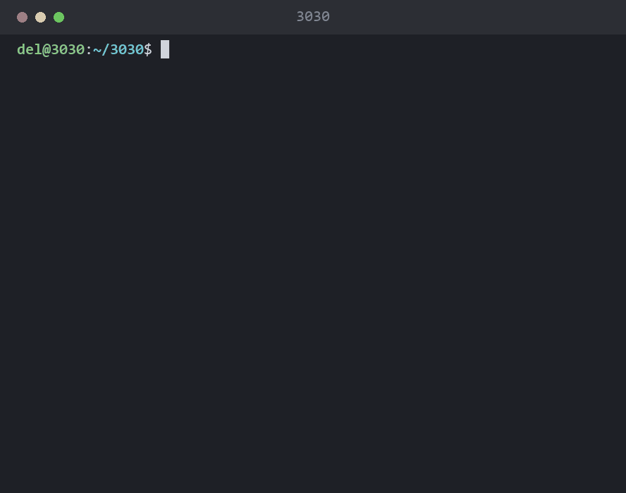
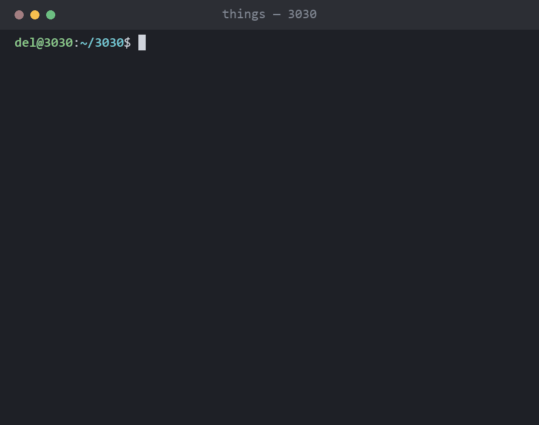
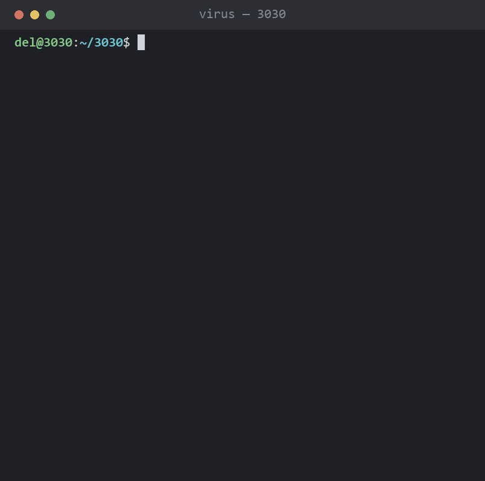
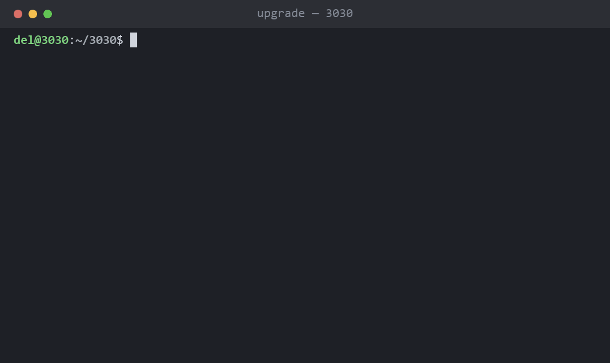
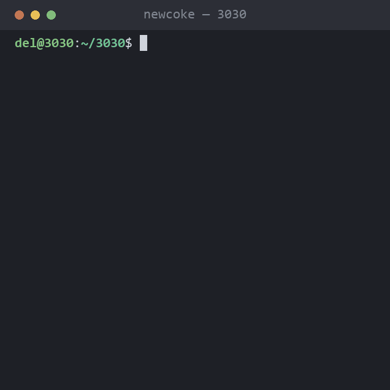
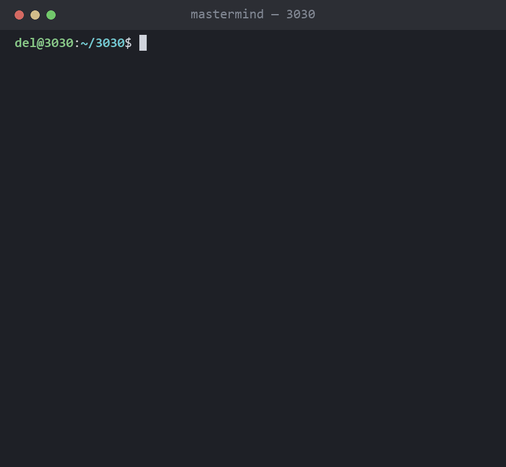
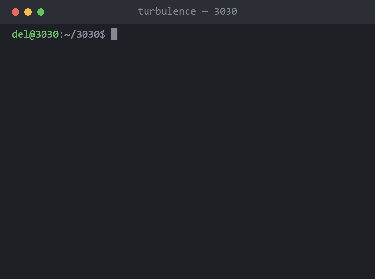

# 3030

> _"I want to devise a virus / to bring dire straits to your environment /
> crash your whole computer system / and revert you to papyrus"_
> — Deltron 3030, _Virus_ (2000)

Deltron 3030 is a concept album from 2000 about a mech soldier rap battling
through a corporate dystopia in the year 3030. Half its tracklist describes
technology failing people in ways that turn out to be very easy to render in
a terminal.

So: the album, as command-line programs. One file per track.



```bash
python deltron.py            # the tracklist
python deltron.py virus      # play a track
python deltron.py --check    # every self-check in the repo
```

Stdlib only. Python 3.8+. No pip install, no venv, nothing to uninstall.

## The tracklist

### 2. 3030 — `y3k.py`

The only thing here that does something real. A Y3K compliance checker: it
scans for date handling that will not survive the year 3030 and reports the
year each finding actually breaks in.

```bash
python y3k.py             # scan the current directory
python y3k.py path/to/src
```

2038 for 32-bit clocks and 2100 for two-digit years are genuine bugs with
genuine dates attached. The Y10K rule is not, and is marked LOW accordingly.
Exits 1 on findings, so it works in CI, which is an absurd thing for this
repo to be able to say. `y3k: ignore` on a line skips it;
`y3k: ignore-start` / `-end` skips a block.

### 4. Things You Can Do — `things.py`

A capability list. Everything on it is unavailable.



```bash
python things.py            # the list
python things.py 17         # attempt one of them
python things.py --all      # attempt all of them
```

The help text is the entire product. Every reason is one a real product has
given someone: `available on the Enterprise plan`, `requires the mobile app`,
`removed in v3030.2`, `you are speaking to a person`. `--all` exits 1,
because zero of twenty available is a failure by any honest measure.

### 5. Positive Contact — `contact.py`

A distributed-computing screensaver that listens for intelligent life, finds
it, and resolves it into a mineral rights filing before the greeting has
finished decoding.

```bash
python contact.py
```

```
  POSITIVE CONTACT   signal-to-noise 31.4
  Kepler-442 b
    DECODE    language decoded
              they said: "we have been waiting"
    CLAIM     mineral rights filed
    RESOLVE   contact resolved
              1,200,000,000 t heavy water -> Ubiquitous Media
```

The track is about assimilating matter and energy on the way through space.
This is that as a workflow: understanding them comes first and changes
nothing. `reply` is not one of the six steps, and the self-check asserts it
never becomes one. The shell companies are imported from `news.py`, because
of course it is the same companies.

### 7. Virus — `virus.py`

Somebody had to try. Four acts: a fake boot, the impossible requirements
failing deadpan, a Win95 folder bomb **rendered rather than executed**, and a
terminal that slowly fills with papyrus until it is a scroll.

It does **nothing** to your computer. That is the joke — the honest
implementation of the entire verse is one `print()`, and this is four hundred
lines instead.



```bash
python virus.py            # ~45s, bassline on
python virus.py --fast     # two seconds
```

#### The spec review, for that one verse

Before writing it we triaged the requirements. The client is Del. The spec
is a rap verse.

| Requirement | Verdict |
|---|---|
| "bring dire straits to your environment" | a mood, not a spec |
| "revert you to papyrus" | closest real behavior is *paperweight*. off by one material |
| "no Microsoft or Windows when I'm through" | you cannot uninstall a corporation |
| "a file gets deleted / Bingo! hard drive" | this is `del`. shipped 1981. **Del invented Del** |
| "shut down the entire whitehouse" | air-gapped |
| "corrupt politicians" | no-op, idempotent |
| "even space stations" | 400ms RTT, custom RTOS, they'd notice |
| "3030" | a thousand years of forward compat. a millennium LTS |

Exactly one line in the verse describes a real mechanism: **replication**.
The Win95 folder bomb — not clever, just `mkdir` in a loop until Explorer
gave up. So that is the one we perform, and we perform it as theater.

### 8. Upgrade (A Brymar College Course) — `upgrade.py`

An upgrade process that is flawless, thorough, patient, beautifully
instrumented, and changes nothing. A changelog of filler. An ETA that gets
worse before it gets better. Config migrated into itself. A restart into the
identical screen. The version goes up, the feature count goes down, and the
last line is `0 files changed`, which is a true statement about the program
rather than a bit.



```bash
python upgrade.py              # ~40s
python upgrade.py --rollback   # the truest line in the program
```

`virus.py` is a threat that cannot be carried out. `upgrade.py` is a promise
kept to the letter that means nothing. Same joke from the other end.

### 9. New Coke — `newcoke.py`

A rebrand. It renames the product, migrates almost nothing, and ends with two
products instead of one, forever.



```
  brands                    1  ->  2
  products                  1  ->  2
  support queues            1  ->  2
  things anyone asked for   0  ->  0

  Ubiquitous Classic is available from today.
  You now maintain both. Forever.
```

Sibling to `upgrade.py`: that one is a change that changes nothing, this one
is a change that doubles what it touched. 50 references renamed, 837 not —
including the URL, the schema, the legal entity, and what customers call it.

### 10. Mastermind — `mastermind.py`

A lock on the corporate tower and ten tries at it. Six glyphs, four slots,
repeats allowed; after each attempt the panel says how many glyphs are in the
right slot and how many are right but somewhere else.



```bash
python mastermind.py            # play
python mastermind.py --seed 7   # the same lock every time
```

The one program here that is a real game, with logic you can lose to. The
rest of the album is theater; this one keeps score. A malformed guess is a
typo, not an attempt, and does not cost you one.

### 12. Madness — `madness.py`

A fuzzer. The inputs are genuinely hostile — nul bytes, `2**63`, NaN,
`'; DROP TABLE --`, an RTL override, 2038 timestamps. Ten thousand cases,
zero failures. Then it shows you the assertion:


```
      def check(value):
          return True
```

The inputs are real. The oracle is the problem, which is the point: a suite
that cannot fail is not a suite, it is a decoration. The self-check asserts
that `check()` still cannot fail, so nobody quietly gives it teeth and turns
this into a different program.

### 14. Time Keeps On Slipping — `slipping.py`

A clock that is correct when it starts and is not correct for long. The drift
is exponential, so the first half minute looks fine, a minute in you are a
couple of minutes fast, three minutes in you are weeks ahead, and around
minute five it arrives in 3030 and stops.

```bash
python slipping.py             # ~5 min to 3030
python slipping.py --drift 4   # slip sooner (time constant, seconds)
```

`--drift` is the calibration knob. The default is tuned so the slip stays
invisible exactly long enough to be annoying.

### 15. The News — `news.py`

A broadcast where the ownership disclosure is longer than the story, and gets
longer with every story, until the chain closes on itself.

```bash
python news.py
```

```
  Broadcast licence renewed. No other bids were possible.
    a wholly owned subsidiary of Ubiquitous Media
      a wholly owned subsidiary of Vandal Broadcast Group
        ...
              a wholly owned subsidiary of an algorithm nobody has read
                a wholly owned subsidiary of itself
```

The title was already the whole program. All that was left was to run the
disclosure to its logical end. Every company named is invented — the joke is
the structure, not any real one.

### 16. Turbulence — `turbulence.py`

A route to the tower, degrading in front of you. Latency climbs, hops start
starring out, the path flaps between two routes that are both wrong, and then
there is no route at all.



```bash
python turbulence.py             # ~35s to total loss
python turbulence.py --speed 4   # four times faster
```

It reaches nothing. There are no sockets in the file and every host is on
`.3030`, a TLD that does not exist — a convincing fake network tool is a much
worse idea than a convincing fake virus. The self-check asserts both: no
network module is loaded, and no hostname could resolve.

It ends on `0 packets sent. 0 packets received. None of this happened.`

### 18. Battlesong — `battlesong.py`

Two sorting algorithms, six rounds, one judge. The battle is real: both
contenders actually sort and the times are measured, not invented.

```
  round 1  n=200   bubble      1.0ms   timsort   0.02ms   x62
  round 6  n=2000  bubble    107.0ms   timsort   0.14ms   x772
  RESULT  timsort 6 - 0 bubble
```

The joke is not who wins. It is that the outcome is settled in round one and
we run all six anyway, with the loser's boasts getting longer as the margin
widens. That x62 → x772 is measured O(n²) against O(n log n). Both answers
are identical every round, which the self-check enforces — a rigged benchmark
would not be funny.


### 20. Memory Loss — `memory.py`

Memory climbs. The description of what it is doing gets shorter. By the end
it is using a gigabyte and cannot tell you what for.

```bash
python memory.py
```

```
  MEMORY LOSS v3030.1   Reticulating splines in sector 7 (batch 3 of 12)     84 MiB
  MEMORY LOSS           Reticulating                                        194 MiB
  MEM                   Working                                             590 MiB
                        ...                                               1,028 MiB
```

The banner forgets its own name on the same slope. Nothing is actually
allocated; the number is a number. It ends on `0 freed. I don't remember why.`
## The safety rails, since one of these is called `virus`

- No writes outside this repo, with exactly one exception: on macOS, audio
  writes a single temporary WAV because `afplay` cannot read stdin, and
  deletes it immediately. Windows and Linux write nothing at all.
- No self-replication, ever. The folder bomb is `print()` in a loop.
- No network, no subprocess against the system, no registry, no startup
  entry, no persistence.
- `upgrade.py` never touches a real package manager. A fake upgrade that
  shells out to a real one is not a joke.
- `finally:` restores your cursor and colors on Ctrl-C. Always.
- `python deltron.py --check` asserts all of it, per track.

The self-checks assert the jokes, not just the code: that the ETA gets worse
before it gets better, that `This will only take a moment` is the longest
step, that the clock is correct at zero seconds, that the post-upgrade banner
comes back **unchanged**.

## The music

Every track has its own cue, and they play on all three platforms. `audio.py`
synthesises a WAV in memory with stdlib `wave` and hands the bytes to whatever
the machine has:

| | |
|---|---|
| Windows | `winsound.PlaySound(..., SND_MEMORY)` — no file at all |
| Linux | `aplay` / `paplay` / `play`, WAV on stdin — no file at all |
| macOS | `afplay`, which insists on a path — one temp file, deleted immediately |

If none of that works everything falls silent and every program still runs. A
missing player is not an error; it is a quiet Tuesday. Sound is also off
automatically whenever stdout is not a terminal, so piping, redirecting, CI
and the self-checks never make a noise.

Thirteen cues, each its own small idea: a bassline for `virus`, a fanfare that
resolves to the note it started on for `upgrade`, two notes down for `things`,
a beacon nobody answers for `contact`, a jingle that plays itself twice for
`newcoke`, tumblers falling for `mastermind`, something that never resolves
for `madness`, a phrase that loses a note each time round for `memory`.

```bash
python audio.py            # play every cue
python audio.py virus      # play one
python music.py            # -> midi/*.mid, one per track
```

`music.py` writes the same notes out as MIDI with hand-rolled `struct.pack`
and no library — it imports the cues from `audio.py` rather than copying them,
so a cue and its `.mid` cannot drift apart. Every riff is original; see the
Notice.

## How it is put together

```
deltron.py     the umbrella. runpy, not a plugin system
theater.py     the shared stage: typewriter, sleeps, terminal restore
audio.py       the cues, and WAV playback on all three platforms
music.py       writes midi/*.mid, one per track

y3k.py         track 2
things.py      track 4
contact.py     track 5
virus.py       track 7
upgrade.py     track 8
newcoke.py     track 9
mastermind.py  track 10
madness.py     track 12
slipping.py    track 14
news.py        track 15
turbulence.py  track 16
battlesong.py  track 18
memory.py      track 20

lyrics.txt     act 4 of virus scrolls whatever is in here
changelog.txt  the filler upgrade.py reads
midi/          one .mid per track, written by music.py
docs/demos.py  makes every image above, with termshot
```

`theater.py` was extracted at the **fourth** track, not the first — three
programs had grown their own copy by then, which is when you know what the
shared thing actually is. The third track (`y3k.py`) turned out not to want
it at all, being a linter rather than an animation.

None of the images are screen recordings. They are
[termshot](https://github.com/sp00nznet/termshot), which fakes terminal
captures with Pillow — faking demos of programs that are themselves fakes
felt correct. Mastermind's demo scores its guesses with the real `score()`
from `mastermind.py`, so the feedback in the GIF cannot drift into something
the game would never print.

`slipping` and `y3k` have no image on purpose: slipping's joke is five
minutes long and a GIF cannot hold it, and y3k prints a static report that
reads better as the text above than as a picture of text.

## Binaries

PyInstaller cannot cross-compile, so
[`.github/workflows/build.yml`](.github/workflows/build.yml) builds on one
runner per platform and uploads `deltron` / `deltron.exe` on any `v*` tag.
The macOS build is arm64 and unsigned — right-click → Open the first time, or
`xattr -d com.apple.quarantine deltron`.

You do not need any of that. Every track is stdlib-only Python with a
shebang, so `./deltron.py virus` already works everywhere.

## Notice

An unofficial, non-commercial fan project. Not affiliated with, endorsed by,
or connected to Deltron 3030, Del the Funky Homosapien, Dan the Automator,
Kid Koala, or their labels. Made as homage, by someone who thinks a 2000
concept album about a mech soldier rap battling through a corporate dystopia
is one of the best records ever built.

- **The lyrics** are a four-line excerpt, quoted with attribution, in a
  project that exists to comment on those four lines. Rights remain with
  their owners. Don't paste the full verse into the repo.
- **The music is original.** Thirteen short cues written to sound like cheap
  hardware from 1997. None of it is a transcription of, sample of, or
  derivative of the album's instrumentals.
- **The code** is free to take. The song isn't ours to give.

## License

MIT for everything in this repo — code, the MIDI files, docs. See
[LICENSE](LICENSE), which carves out the quoted lyrics: those aren't ours to
license to you.

## Credit

Deltron 3030 — Del the Funky Homosapien, Dan the Automator, Kid Koala.
Go buy the album. It's better than this.

**[deltron3030.com](https://deltron3030.com/)** — the official site. Tour
dates, music, merch. They are playing shows again, which is a better use of
an evening than any of this.

Still not affiliated with them in any way. Just pointing at the people who
made the thing worth making a joke about.
